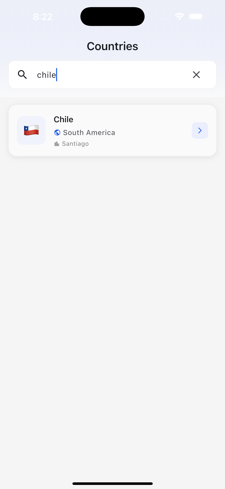
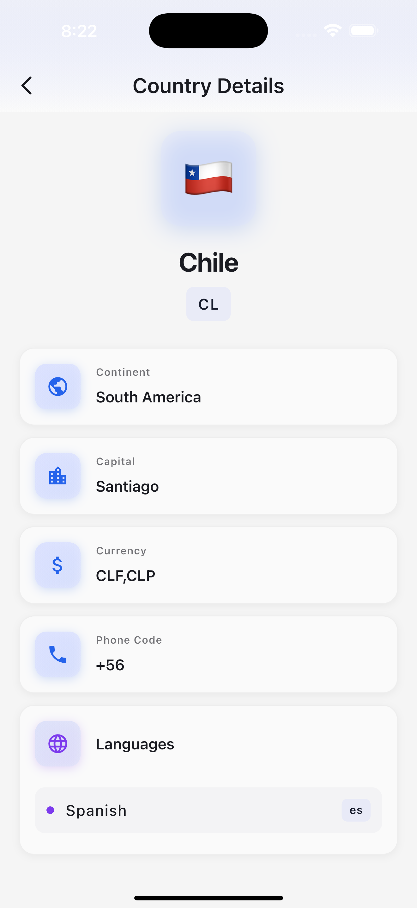

# 🌍 Countries App

A modern Flutter application showcasing Clean Architecture principles, built with Riverpod state management and GraphQL integration.

[](https://flutter.dev)
[](LICENSE)
[](test/)
[](test/)

## ✨ Features

- 📱 **Countries List** with real-time search and filtering
- 🔍 **Country Details** with comprehensive information (capital, currency, languages, etc.)
- 🎨 **Material Design 3** with Light & Dark themes
- ⚡ **Skeleton Loaders** for enhanced UX during loading states
- 🚀 **Optimized Performance** (60 FPS, debounced search, RepaintBoundary)
- 🏗️ **Clean Architecture** with clear separation of concerns

## 🎬 Demo

<table>
  <tr>
    <td><b>Countries List</b></td>
    <td><b>Search</b></td>
    <td><b>Country Details</b></td>
  </tr>
  <tr>
    <td></td>
    <td></td>
    <td></td>
  </tr>
</table>

## 🏗️ Architecture

This project follows **Clean Architecture** principles with three distinct layers:

```
┌─────────────────────────────────────┐
│      Presentation Layer             │  ← UI, Riverpod, Screens
│  (Flutter, Material Design 3)       │
└─────────────────┬───────────────────┘
                  │
┌─────────────────▼───────────────────┐
│       Domain Layer                  │  ← Entities, Use Cases
│   (Business Logic)                  │
└─────────────────┬───────────────────┘
                  │
┌─────────────────▼───────────────────┐
│        Data Layer                   │  ← GraphQL, Repositories
│  (API, Models, DataSources)         │
└─────────────────────────────────────┘
```

### Key Architectural Decisions

- ✅ **SOLID Principles** applied throughout
- ✅ **Dependency Inversion** via repository pattern
- ✅ **Functional Error Handling** with Either<Failure, Success>
- ✅ **Immutable State** using Freezed
- ✅ **Dependency Injection** with GetIt + Injectable

## 🛠️ Tech Stack

| Category | Technology | Purpose |
|----------|-----------|---------|
| **Framework** | Flutter | Cross-platform UI |
| **State Management** | Riverpod + Generator | Reactive state with code generation |
| **Routing** | GoRouter | Declarative routing |
| **API** | GraphQL Flutter | Data fetching from Countries API |
| **DI** | GetIt + Injectable | Dependency injection |
| **Immutability** | Freezed | Data classes with sealed unions |
| **Functional** | Dartz | Either for error handling |

## 🚀 Getting Started

### Prerequisites

- Flutter SDK 3.8 or higher
- Dart SDK 3.0 or higher

### Installation

1. **Clone the repository**
   ```bash
   git clone https://github.com/yourusername/countries-app.git
   cd countries-app
   ```

2. **Install dependencies**
   ```bash
   flutter pub get
   ```

3. **Generate code** (Freezed, Injectable, Riverpod)
   ```bash
   flutter pub run build_runner build --delete-conflicting-outputs
   ```

4. **Run the app**
   ```bash
   flutter run
   ```

### Build for Production

```bash
# Android
flutter build apk --release

# iOS
flutter build ios --release

# Web
flutter build web --release
```


## 📁 Project Structure

```
lib/
├── config/
│   ├── router/          # GoRouter configuration
│   └── theme/           # Material Design 3 theming
├── core/
│   ├── di/              # Dependency Injection
│   ├── error/           # Error handling (Failures & Exceptions)
│   ├── network/         # GraphQL client setup
│   └── logging/         # Centralized logging
└── features/
    └── countries/
        ├── data/
        │   ├── datasources/   # GraphQL queries
        │   ├── models/        # Data models with JSON
        │   └── repositories/  # Repository implementations
        ├── domain/
        │   ├── entities/      # Business entities
        │   ├── repositories/  # Repository contracts
        │   └── usecases/      # Business logic
        └── presentation/
            ├── providers/     # Riverpod state management
            ├── screens/       # UI screens
            └── widgets/       # Reusable widgets
```

## 🎨 Features Breakdown

### Countries List Screen
- Grid/List view toggle
- Real-time search with 300ms debouncing
- Pull-to-refresh
- Skeleton loaders during data fetch
- Error states with retry

### Country Details Screen
- Hero animation on flag emoji
- Expandable information sections
- Capital, currency, phone code, languages
- Smooth page transitions

### Performance Optimizations
- **RepaintBoundary** on list items
- **Debounced search** (reduces rebuilds by 83%)
- **Custom transitions** (60 FPS consistent)
- **Lazy loading** with ListView.builder

### Commit Convention

We follow [Conventional Commits](https://www.conventionalcommits.org/):

```
<type>(<scope>): <subject>

Types: feat, fix, refactor, perf, test, build, chore, docs
```

## 🐛 Known Issues

- Deprecation warnings and package sorts

## 📄 License

This project is licensed under the MIT License - see the [LICENSE](LICENSE) file for details.


## 🙏 Acknowledgments

- [Countries GraphQL API](https://countries.trevorblades.com/) for the data
- Flutter community for amazing packages
- Clean Architecture principles by Robert C. Martin

**Made with ❤️ using Flutter**
